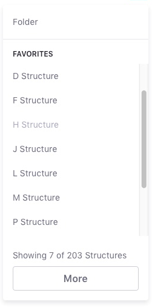

# Create both low-level and high-level components that are exported from each package.

## Context

The primary issue we are facing right now is determining how "high-level" the component should be. For example, should we create a single component with many props, or should we create many components to be composed together.

```jsx
<ClayCard>
	<ClayCard.Title onClick={handleTitleClick}>
		<ClayIcon symbol="check" />

		{'Hello World'}
	</ClayCard.Title>

	<ClayCard.Body onClick={handleBodyClick}>
		<ClayCard.Description>
			{'Some cool descriptors'}
		</ClayCard.Description>
	</ClayCard.Body>
</ClayCard>

// vs
<ClayCard
	iconTitleLeftSymbol="check"
	onTitleClick={handleTitleClick}
	onBodyClick={handleBodyClick}
	description="foo bar baz"
	title="hello world"
/>
```

## Decision

The decision going forward is to create 2 sets of components

-   low-level composable components such as `<ClayCard.Header>`, `<ClayCard.Footer>`
-   simple high-level components that cover basic lexicon uses

### What does this look like?

#### Composable:


```jsx
<ClayDropDown>
	<ClayDropDown.Search
		onChange={() => {}}
		placeholder="Search"
		spritemap={spritemap}
		value={''}
	/>

	<ClayDropDown.ItemList>
		{items.map((item, i) => (
			<ClayDropDown.Item href={item.href} key={i}>
				{item.label}
			</ClayDropDown.Item>
		))}
	</ClayDropDown.ItemList>
</ClayDropDown>
```

Composing gives the user more control over the layout and interactions.

#### High-level:



```jsx
<ClayDropDownWithPagination
	delta={7}
	header="Favorites"
	items={items} // array of objects with `label` and `href`
	message={'Showing {0} of {1} Structures'}
	title="Folder"
/>
```

You'll notice that the high-level component handles much of the interactions internally. It will handle the click of the `show more`, paginate, and update language as necessary. In fact, even this high-level component will be made from the smaller low-level building blocks.

Finally, both the high-level and low-level components will be exported from each package. The low-level component will be exported as default, but the high-level ones will be exported by name. The high-level components should be put into a

For example:

```jsx
export {ClayDropDownWithPagination};

export default ClayDropDown;
```

## Consequences

Benefits:

-   Gives users high-level components to import and use right away.
-   Gives users low-level components to build more complex interactions.
-   Gives maintainers leverage by encouraging users to build their own custom components built on our building blocks rather than baking it into one of our high-level versions.

Drawbacks:

-   More lines of code to maintain.
